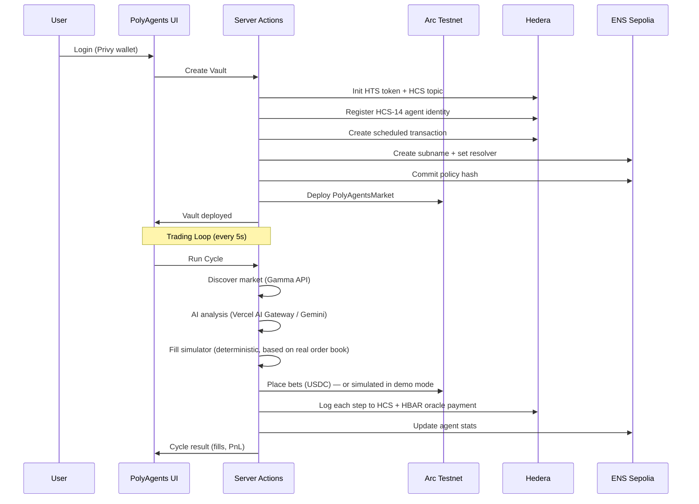
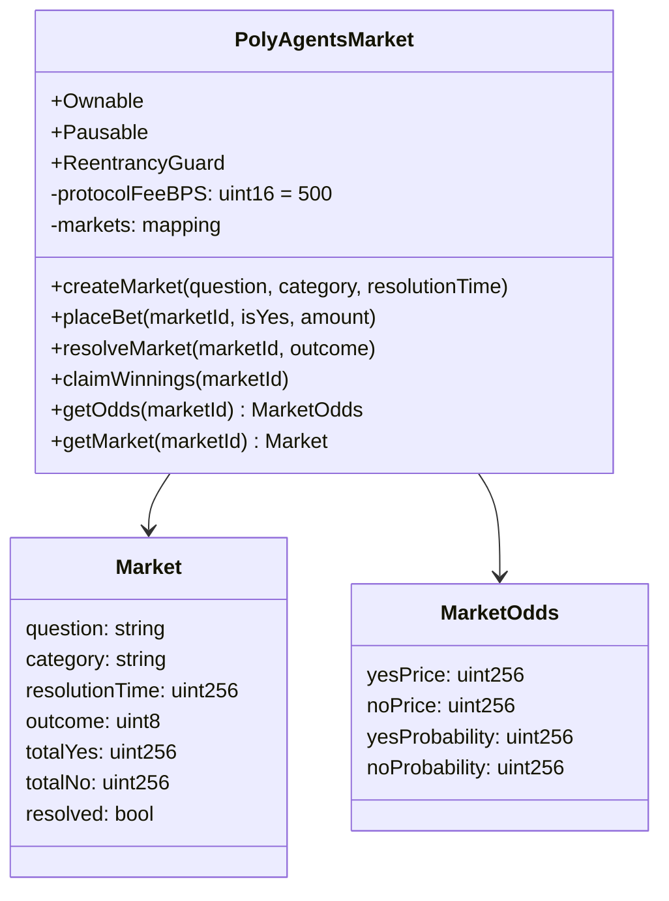

# PolyAgents — Architecture

## System Overview

```mermaid
graph TB
    subgraph UI["Next.js 16 + React 19"]
    subgraph Privy["Wallet Auth"]
    subgraph ServerActions["Server Actions"]
    subgraph Engine["Trading Engine"]

    Privy --> UI
    UI -->|create_vault| ServerActions
    UI -->|run_cycle| ServerActions
    UI -->|toggle_agent| ServerActions

    ServerActions -->|init_vault| Hedera
    ServerActions -->|commit_policy| ENS
    ServerActions -->|create_market| Arc
    ServerActions -->|analyze| VercelAI

    Engine -->|discover| Polymarket
    Engine -->|fill_sim| FillSim
    Engine -->|place_bets| Arc
    Engine -->|log_audit| Hedera
    Engine -->|update_stats| ENS

    subgraph Arc["Arc Testnet (EVM L1)"]
    subgraph Hedera["Hedera Testnet"]
    subgraph ENS["ENS (Sepolia)"]
    subgraph VercelAI["Vercel AI Gateway"]
    subgraph Polymarket["Polymarket API"]
    subgraph FillSim["Fill Simulator"]

    Arc -->|USDC Markets| PolyAgentsMarket.sol
    Arc -->|create_market| PolyAgentsMarket.sol
    Arc -->|place_bet| PolyAgentsMarket.sol
    Arc -->|resolve| PolyAgentsMarket.sol

    Hedera -->|HTS| "Token Gate"
    Hedera -->|HCS| "Audit Log"
    Hedera -->|HCS14| "Agent Identity"
    Hedera -->|HBAR| Micropayments
    Hedera -->|Scheduled| TX

    ENS -->|policy_hash| "policy.commitment"
    ENS -->|agent_stats| "agent.* text records"
    ENS -->|profile| "ENSIP-25 identity"

    VercelAI -->|trade_decision| "Gemini 2.0 Flash Lite"

    Polymarket -->|market_data| "Gamma API"
    Polymarket -->|order_book| "CLOB API"

    FillSim -->|deterministic| "Real order book data"
```

## Data Flow



## Trading Cycle

The engine runs a 13-step cycle every 5 seconds via `actions/engine/workflows/trading-cycle.ts`:

| Step | Name | Description |
|------|------|-------------|
| 1 | Discover | Find active BTC 5-min market via Gamma API |
| 2 | AI Analysis | Get trade decision from Vercel AI Gateway (Gemini 2.0 Flash Lite) |
| 3 | Pay Oracle | Pay HBAR micropayment for LLM usage (if topic configured) |
| 4 | Handle Expiry | Cancel stale orders from previous market |
| 4.5 | Bridge (live only) | Ensure Polygon USDC liquidity via Circle bridge |
| 5 | Place Bets | Submit limit orders (simulated in demo/simulator mode) |
| 6 | Check Fills | Detect filled orders |
| 7 | Sell Coverage | Place sell orders for held inventory |
| 8 | Mirror to Arc | Mirror filled bets to Arc vault contract |
| 9 | Reconcile | Periodic settlement (every N cycles) |
| 10 | PnL | Calculate cumulative PnL |
| 10.5 | Repatriate (live only) | Bridge profits Polygon → Arc |
| 11 | Market Data | Build active market data for UI |
| 12 | Log Hedera | Audit log to HCS |
| 13 | Update ENS | Update agent stats on ENS subname |

Each step logs to Hedera HCS as an individual audit message (`logEngineStep()`), enabling full on-chain traceability of every cycle.

## Operating Modes

| `POLYMARKET_LIVE` | Adapter | Orders | Market Data | Bridges |
|---|---|---|---|---|
| `true` | ClobAdapter | Real CLOB | Real | Active |
| `demo` | ClobAdapter | Real CLOB | Real | Skipped |
| `false` | ReadOnlyClobAdapter | Simulated | Real | Skipped |

Default is `false` (pure simulator). The fill simulator uses deterministic rules against real order book data — fills BUY when bestAsk <= our price, fills SELL when bestBid >= our price.

## Smart Contract: PolyAgentsMarket.sol (Arc Testnet)



## Sponsor Chain Integration

| Chain | Role | Gas Token | Key Features |
|-------|------|-----------|--------------|
| **Arc** (EVM L1) | Prediction markets | USDC | `PolyAgentsMarket` contract, 0.5% protocol fee |
| **Hedera** | Audit + Identity | HBAR | HCS per-step logging, HTS token gate, HCS-14 agent ID, scheduled TX, HBAR oracle micropayments |
| **ENS** (Sepolia) | Policy verification | ETH | Strategy hash commitment on subnames, ENSIP-25 agent profile, live agent stats |

## Key Files

### Trading Engine

| File | Purpose |
|------|---------|
| `actions/engine/index.ts` | Engine server actions (start, stop, status, single cycle) |
| `actions/engine/store.ts` | In-memory vault run state + market state |
| `actions/engine/workflows/trading-cycle.ts` | Main 13-step cycle orchestrator |
| `actions/engine/workflows/continuous.ts` | Auto-cycle loop (5s interval) |
| `actions/engine/workflows/vault-deploy.ts` | Vault deployment workflow |
| `actions/engine/steps/` | 11 modular engine steps (discover, analyze, bet, fills, sell, expiry, reconcile, log, ens, mirror-arc, bridge) |
| `actions/engine/vertex/analyze.ts` | AI analysis via Vercel AI Gateway |

### Engine Libs

| File | Purpose |
|------|---------|
| `lib/engine/adapters/polymarket-clob.ts` | CLOB adapter (live/demo/simulator modes) |
| `lib/engine/adapters/polymarket-readonly.ts` | Read-only market data (Gamma API + CLOB order book) |
| `lib/engine/adapters/simulated-exchange.ts` | Simulated order matching |
| `lib/engine/strategy/fill-simulator.ts` | Deterministic fill logic |
| `lib/engine/strategy/risk-engine.ts` | Risk checks |
| `lib/engine/strategy/engine.ts` | Core strategy engine |
| `lib/engine/pnl.ts` | PnL calculation |

### Arc Integration

| File | Purpose |
|------|---------|
| `lib/arc/market-client.ts` | Arc viem client |
| `lib/arc/abi.ts` + `polyagents-abi.json` | Contract ABI |
| `actions/arc/markets.ts` | Arc server actions (create market, place bet, resolve) |
| `actions/arc/fund-vault.ts` | Vault funding |
| `actions/arc/sync-vault.ts` | Vault state sync |

### Hedera Integration

| File | Purpose |
|------|---------|
| `lib/hedera/client.ts` | Hedera SDK client setup |
| `lib/hedera/hcs-logger.ts` | HCS audit logging |
| `lib/hedera/hts-vault.ts` | HTS token creation |
| `lib/hedera/agent-identity.ts` | HCS-14 agent identity |
| `lib/hedera/agent-payment.ts` | HBAR oracle micropayments |
| `lib/hedera/mirror-node.ts` | Mirror Node queries |
| `lib/hedera/scheduler.ts` | Scheduled transactions |
| `lib/hedera/vault-init.ts` | Full vault initialization |
| `actions/hedera/index.ts` | Hedera server actions |

### ENS Integration

| File | Purpose |
|------|---------|
| `lib/ens/client.ts` | ENS viem client (Sepolia) |
| `lib/ens/subname.ts` | Subname creation and resolution |
| `lib/ens/agent-stats.ts` | Agent stats text records |
| `lib/ens/policy-commitment.ts` | Policy hash commitment verification |
| `lib/ens/agent-identity.ts` | ENSIP-25 agent profile |
| `lib/ens/fleet-registry.ts` | Fleet-wide agent registry |
| `lib/ens/vault-ens-init.ts` | Vault ENS initialization |
| `lib/ens/vault-metadata.ts` | Vault metadata records |
| `actions/ens/index.ts` | ENS server actions |

### Types & Contracts

| File | Purpose |
|------|---------|
| `types/vault.ts` | Vault interface |
| `types/engine.ts` | Engine types (audit records, market state) |
| `types/workflow.ts` | Workflow result types |
| `types/trade-decision.ts` | AI trade decision types |
| `types/hedera.ts` | Hedera types (HCS, HTS, payments) |
| `types/engine-schemas.ts` | Strategy config schema |
| `types/agent.ts` | Agent types |
| `contracts/SimpleTextResolver.sol` | ENS text resolver for Sepolia |
