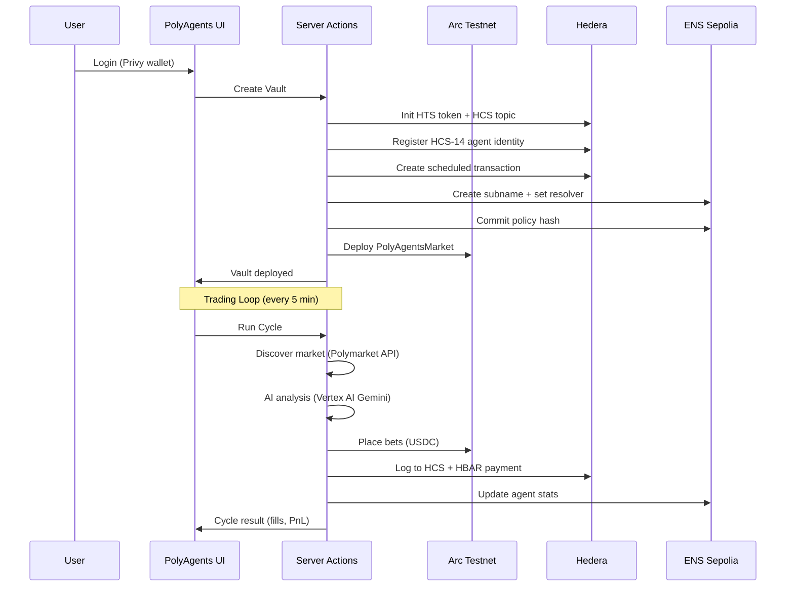
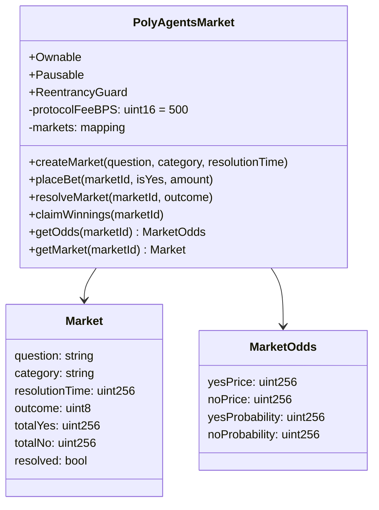

# PolyAgents — Architecture

## System Overview (Mermaid)

```mermaid
graph TB
    subgraph UI["Next.js 16 + React 19"]
    subgraph Privy[Wallet Auth]
    subgraph Server Actions["use server"]
    subgraph Vault Engine[Trading Cycle]

    Privy --> UI
    UI -->|create_vault| Server Actions
    UI -->|run_cycle| Server Actions
    UI -->|toggle_agent| Server Actions

    Server Actions -->|init_vault| Hedera
    Server Actions -->|commit_policy| ENS
    Server Actions -->|create_market| Arc
    Server Actions -->|analyze| VertexAI

    Vault Engine -->|discover| Polymarket
    Vault Engine -->|place_bets| Arc
    Vault Engine -->|log_audit| Hedera
    Vault Engine -->|update_stats| ENS

    subgraph Arc["Arc Testnet (EVM L1)"]
    subgraph Hedera["Hedera Testnet"]
    subgraph ENS["ENS (Sepolia)"]
    subgraph VertexAI["Vertex AI (Gemini)"]
    subgraph Polymarket["Polymarket API"]

    Arc -->|USDC Markets| PolyAgentsMarket.sol
    Arc -->|create_market| PolyAgentsMarket.sol
    Arc -->|place_bet| PolyAgentsMarket.sol
    Arc -->|resolve| PolyAgentsMarket.sol

    Hedera -->|HTS| Token Gate
    Hedera -->|HCS| Audit Log
    Hedera -->|HCS14| Agent Identity
    Hedera -->|HBAR| Micropayments
    Hedera -->|Scheduled| TX

    ENS -->|policy_hash| policy.commitment
    ENS -->|agent_stats| agent.* text records
    ENS -->|profile| ENSIP-25 identity

    VertexAI -->|trade_decision| Market analysis
```

## Data Flow



## Smart Contract: PolyAgentsMarket.sol (Arc Testnet)



## Sponsor Chain Integration

| Chain | Role | Gas Token | Key Features |
|-------|------|-----------|--------------|
| **Arc** (EVM L1) | Prediction markets | USDC | `PolyAgentsMarket` contract, 0.5% protocol fee |
| **Hedera** | Audit + Identity | HBAR | HCS logging, HTS token gate, HCS-14 agent ID, scheduled TX |
| **ENS** (Sepolia) | Policy verification | ETH | Strategy hash commitment on subnames, ENSIP-25 agent profile |

## Key Files

| File | Purpose |
|------|---------|
| `contracts/src/PolyAgentsMarket.sol` | Solidity contract |
| `lib/arc/market-client.ts` | Arc viem client |
| `actions/arc/markets.ts` | Arc server actions |
| `lib/hedera/` | Hedera SDK wrappers (7 files) |
| `actions/hedera/index.ts` | Hedera server actions |
| `lib/ens/` | ENS SDK wrappers (8 files) |
| `actions/ens/index.ts` | ENS server actions |
| `actions/engine/` | Trading engine (store, steps, workflows, vertex) |
